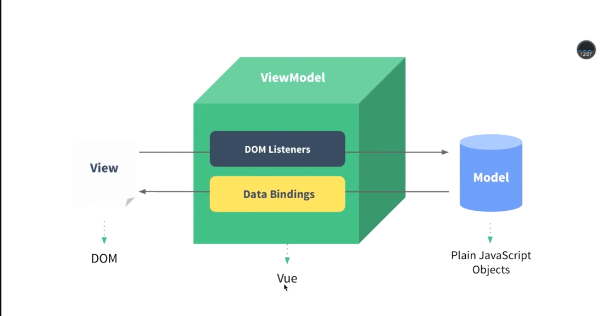
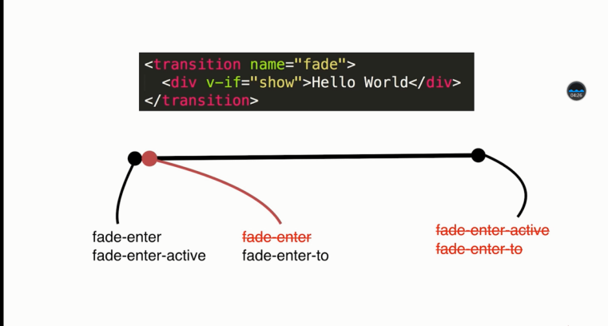
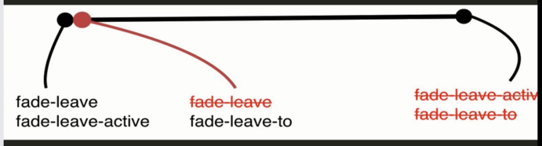

# vue.js


## Hello World

```html
<body>
    <div id="root">
        <div @click="handleClick">       <!--绑定事件-->
        {{message}}     <!--表达data中的massage-->
        </div>
        <item></item>    <!--使用组件-->
    </div>

    <script>
        //组件也是Vue实例
        Vue.component('item',{
            template:'<div>这里是item组件</div>'
        })
        
        // 根Vue实例
        var vm=new Vue({
            el:'#root',//选择ID为root的标签
            data:{
                message:'hello world'
            },
            methods:{
                handleClick:function () {
                    alert("hello")
                }
            }
        })
    </script>
</body>
```


## Vue实例

### MVVM设计模式




### Vue数据的响应式系统

当一个 Vue 实例被创建时，它将 `data` 对象中的所有的属性加入到 Vue 的**响应式系统**中。当这些属性的值发生改变时，视图将会产生“响应”，即匹配更新为新的值。

```javascript
// 我们的数据对象
var data = { a: 1 }

// 该对象被加入到一个 Vue 实例中
var vm = new Vue({
  data: data
})

// 获得这个实例上的属性
// 返回源数据中对应的字段
vm.a == data.a // => true

// 设置属性也会影响到原始数据
vm.a = 2
data.a // => 2

// ……反之亦然
data.a = 3
vm.a // => 3
```

当这些数据改变时，视图会进行重渲染。值得注意的是只有当实例被创建时 `data` 中存在的属性才是**响应式**的。也就是说如果你添加一个新的属性，比如：

```javascript
vm.b = 'hi'
```

那么对 `b` 的改动将不会触发任何视图的更新。如果你知道你会在晚些时候需要一个属性，但是一开始它为空或不存在，那么你仅需要设置一些初始值。比如：

```javascript
data: {
  newTodoText: '',
  visitCount: 0,
  hideCompletedTodos: false,
  todos: [],
  error: null
}
```

这里唯一的例外是使用 `Object.freeze()`，这会阻止修改现有的属性，也意味着响应系统无法再*追踪*变化。

```html
var obj = {
  foo: 'bar'
}

Object.freeze(obj)

new Vue({
  el: '#app',
  data: obj
})
<div id="app">
  <p>{{ foo }}</p>
  <!-- 这里的 `foo` 不会更新！ -->
  <button v-on:click="foo = 'baz'">Change it</button>
</div>
```

除了数据属性，Vue 实例还暴露了一些有用的实例属性与方法。它们都有前缀 `$`，以便与用户定义的属性区分开来。例如：

```javascript
var data = { a: 1 }
var vm = new Vue({
  el: '#example',
  data: data
})

vm.$data === data // => true
vm.$el === document.getElementById('example') // => true

// $watch 是一个实例方法
vm.$watch('a', function (newValue, oldValue) {
  // 这个回调将在 `vm.a` 改变后调用
}
```


### Vue实例生命周期钩子

每个Vue实例在被创建时都要经过一系列的初始化过程——例如，需要设置数据监听、编译模板、将实例挂载到 DOM 并在数据变化时更新 DOM 等。同时在这个过程中也会运行一些叫做**生命周期钩子**的函数，这给了用户在不同阶段添加自己的代码的机会。

比如 [`created`](https://cn.vuejs.org/v2/api/#created) 钩子可以用来在一个实例被创建之后执行代码：

```javascript
new Vue({
  data: {
    a: 1
  },
  created: function () {
    // `this` 指向 vm 实例
    console.log('a is: ' + this.a)
  }
})
// => "a is: 1"
```

也有一些其它的钩子，在实例生命周期的不同阶段被调用，如 [`mounted`](https://cn.vuejs.org/v2/api/#mounted)、[`updated`](https://cn.vuejs.org/v2/api/#updated) 和 [`destroyed`](https://cn.vuejs.org/v2/api/#destroyed)。生命周期钩子的 `this` 上下文指向调用它的 Vue 实例。

**不要在选项属性或回调上使用[箭头函数](https://developer.mozilla.org/zh-CN/docs/Web/JavaScript/Reference/Functions/Arrow_functions)，比如 `created: () => console.log(this.a)` 或 `vm.$watch('a', newValue => this.myMethod())`。因为箭头函数并没有 `this`，`this`会作为变量一直向上级词法作用域查找，直至找到为止，经常导致 `Uncaught TypeError: Cannot read property of undefined` 或 `Uncaught TypeError: this.myMethod is not a function` 之类的错误。**


lifecycle图示：


**生命周期函数**（*生命周期函数就是vue实例在某一个时间点会自动执行的函数*）：

**不用写在methods里**

```html
<div id="app"></div>

<script>
    //生命周期函数就是vue实例在某一个时间点会自动执行的函数
    var vm = new Vue({
        el:'#app',
        template:"<div>{{test}}</div>",
        data:{
            test:"LifeCycle"
        },

        //实例创建前
        beforeCreate:function () {
            console.log("beforeCreate()")
        },
        //实例创建后
        created:function () {
            console.log("created()")
        },
        //页面挂载渲染之前
        beforeMount:function () {
            //选择最外层元素的所有内容
            console.log(this.$el);
            console.log("beforeMount()")
        },
        //页面挂载渲染之后，内容被渲染到页面上了
        mounted:function () {
            //选择最外层元素的所有内容
            console.log(this.$el)
            console.log("mounted()")
        },
        //数据发生改变，重新渲染之前
        beforeUpdate:function () {
            console.log("beforeUpdate()")
        },
        //数据发生改变，重新渲染之后
        updated:function () {
            console.log("updated()")
        },
        //实例销毁之前
        beforeDestroy:function () {
            console.log("beforeDestroy()")
        },
        //实例销毁
        destroyed:function () {
            console.log("destroyed()")
        }
    })
</script>

```


## 

## 模板语法

`v-text:插值` 、`v-html:插值` 、和 `{{插值}}` 的区别:

```html
<div id="app">

    <!-- v-text:显示名为name的数据的值,不解析html语法-->
    <div v-text="name"></div>

    <!-- v-html：innerHtml 名为name的数据，解析html语法-->
    <div v-html="name"></div>

    <!--效果和v-text相同-->
    <div>{{name}}</div>
</div>

<script>
    var vm=new Vue({
        el:'#app',
        data:{
            name:"<h1>Dell</h1>",
        },
    })
</script>
```

模板语法文档URL:

<https://cn.vuejs.org/v2/guide/syntax.html>


## 

## 计算属性，方法，侦听器

### **计算属性基础例子：**

````html
<div id="app">
    {{fullName}}
</div>

<script>
    var vm = new Vue({
        el:"#app",
        data:{
            firstName:"Dell",
            lastName:"Lee",
            age: 28,
        },
        //计算属性
        computed:{
            fullName:function () {
                console.log("计算了一次"); 
                return this.firstName+" "+this.lastName
            }
        },
    })
</script>
````


### **方法基础例子：**

```html
<div id="app">
    {{fullName()}}
</div>

<script>
    var vm = new Vue({
        el:"#app",
        data:{
            firstName:"Dell",
            lastName:"Lee",
            age: 28,
        },
        //方法:
        methods:{
            fullName:function () {
                return this.firstName+" "+this.lastName
            }
        }
</script>
```


### **计算属性的缓存机制：**

是**计算属性是基于它们的响应式依赖进行缓存的**。只在相关响应式依赖发生改变时它们才会重新求值。这就意味着在**计算属性基础例子**中只要 `firstName`和`lastName` 还没有发生改变，多次访问 `fullName` 计算属性会立即返回之前的计算结果，而不必再次执行函数。*相比之下，每当触发重新渲染时，调用方法将**总会**再次执行函数。* 

**所以计算属性性能更高**(比method和watch性能都高)


### 侦听器

例子：

```html
<div id="app">
    {{fullName}}
</div>

<script>
    var vm = new Vue({
        el:"#app",
        data:{
            firstName:"Dell",
            lastName:"Lee",
            fullName:"Dell Lee",
            age: 28,
        },
        //侦听器
        watch:{
            //侦听firstName，当侦听到firstName改变时，触发方法
            firstName: function () {
                console.log("侦听到firstName改变，计算一次");
                this.fullName=this.firstName+" "+this.lastName;
            },
            ////侦听lastName，当侦听到lastName改变时，触发方法
            lastName: function () {
                console.log("侦听到lastName改变，计算一次");
                this.fullName=this.firstName+" "+this.lastName;
            }
        }
</script>
```


### 计算属性的getter和setter

例子讲解：

```html
<div id="app">
    {{fullName}}
</div>

<script>
    var vm = new Vue({
        el: "#app",
        data:{
            firstName:"Dell",
            lastName:"Lee",
        },
        computed:{
            fullName:{
                get:function () {
                    return this.firstName+" "+this.lastName
                },
                set:function (value) {
                    //在控制台中输入vm.fullName="MIke Wang",
                    // fullName就会被set为value="Mike Wang"，
                    console.log("fullName被设置成"+value+"了");


                    var arr=value.split(" ");
                    this.firstName = arr[0];
                    this.lastName = arr[1]

                    //控制台输入输出：
                    // <= vm.fullName = "Mike wang"
                    // => "Mike wang"
                    // <= vm.firstName
                    // => "Mike"
                    // <= vm.lastName
                    // => "wang"

                    //用set方法改变了firstName和lastName，
                    //导致get中的计算属性所依赖的值发生改变，导致重新计算并渲染页面
                }
            }
        }
    })
</script>
```


## 

## Vue中的样式绑定

### **1. :class 绑定**

例1：

```html
style: .activated{color:red;}

<body>
<div id="app">
        <!--class的对象绑定-->
        <!--当 isActivated =true的时候才会把 名为activated的class 加进div中-->
        <div @click="handleDivClick"
             :class="{activated: isActivated}"
        >
            hello world
        </div>
    </div>

    <script>
        var vm = new Vue({
            el:"#app",
            data:{
                isActivated:false,
            },
            methods:{
                handleDivClick:function () {
                    this.isActivated = !this.isActivated;
                },
            },
        })
    </script>
</body>
```

例2 数组型class：

```html
style: .activated{color:red;}
<body>
    <div id="app">
        <!--class中数组绑定-->
        <!--显示的class是[xxx,xxx]数组中各个变量中的内容-->
        <!--未点击前div class="activatedOne",点击后div class="activated activated-one"-->
        <div @click="handleDivClick"
             ：class="[activated , activatedOne]"
             >
            hello world
        </div>
    </div>

    <script>
        var vm = new Vue({
            el:"#app",
            data:{
                activated:"",
                activatedOne:"activated-one"
            },
            methods:{
                handleDivClick:function () {
                    this.activated = this.activated === "activated" ?
                        "" : "activated";
                },
            },
        })
    </script>
</body>
```


### 2. :style 绑定

例1：

```html
<body>
    <div id="app">
        <div :style="styleObj"
             @click="handleDivClick"
        >
            hello world
        </div>
    </div>

    <script>
        var vm = new Vue({
            el:"#app",
            data:{
                styleObj:{
                    color:"black"
                }
            },
            methods:{
                handleDivClick:function () {
                  this.styleObj.color = this.styleObj.color==="black" ? "red" : "black" ;
                }
            },
        })
    </script>
</body>
```

例2：数组型

```html
<div id="app">
    <div :style="[styleObj,{fontSize:'20px'}]"
         @click="handleDivClick"
         >
        hello world
    </div>
</div>
<!--其他一样，不过div中可以挂载多个style对象-->
```


## 

## Vue 中的条件渲染

**v-show的性能更高，因为不会频繁删除添加DOM**

- **v-show**：v-show中的内容已经渲染在页面上，但是display:none，当v-show中的变量值为true才能display:block。

`<div v-show="show">{{message}}</div>`


- **v-if**：v-if中的变量值为true才会渲染。

**v-if,v-else-if和v-else的使用：v-if和v-else要紧贴在一起使用(中间不能被其他元素分隔)**

```html
<div v-if="show === 'a'">this is A</div>
<div v-else-if="show === 'b'">this is B</div>
<div v-else="show">This is others</div>
```

注意：key值

```html
<div id="app">
    <!--当show值改变时，Vue会复用<input/>元素，里面的内容不会自动清空，因此要用key值来避免复用，清空input-->
    <div v-if="show">
        用户名：<input key="username"/>
    </div>
    <div v-else>
        邮箱名：<input key="password"/>
    </div>
</div>
```


- 例：

```html
<div id="app">
    <!--v-if中的变量值为true才会渲染-->
    <div v-if="show">{{message}}</div>
    <!--v-show中的内容已经渲染在页面上，但是display:none，当v-show中的变量值为true才能display:block-->
    <div v-show="show">{{message}}</div>
</div>

<script>
    var vm = new Vue({
        el:"#app",
        data:{
            show:false,
            message:"hello world",
        },
        methods:{},
    })
</script>
```


## 

## Vue的列表渲染

### v-for：

demo:

```html
<div id="app">
    <!--为了提高循环显示的性能，会给每一个循环项添加一个唯一的Key值(不推荐用index做key值,一般用item的id)-->
    <div v-for="(item,index) of list"
         :key="item.id">
        {{item.text}} --- {{index}}
    </div>
</div>

<script>
    var vm = new Vue({
        el:"#app",
        data:{
            list:[
                {
                    id:"123412",
                    text:"hello"
                },{
                    id:"100012",
                    text:"Dell"
                },
                {
                    id:"122010",
                    text:"Lee"
                }
            ]
        }
    })
</script>

输出结果：
hello --- 0
Dell --- 1
Lee --- 2
```


多个循环时如何提高性能：

```html
<!--用template包裹比用div包裹，可以避免多渲染一个div-->
<template v-for="(item,index) of list"
          :key="item.id">
    <div>{{item.text}} --- {{index}}</div>
   <span>{{item.text}}</span>
</template>
```


### Vue中的数组操作

Vue 将被侦听的数组的变异方法进行了包裹，所以它们也将会触发视图更新。这些被包裹过的方法包括：

- `push()` 往数组中增加一条

- `pop()` 删除数组中的最后一项

- `shift()` 删除数组的第一项

- `unshift()` 往数组的第一项中增加内容

- `splice()` 数组截取:

  splice(索引index，要删除多少项，添加的内容 )

- `sort()` 对数组进行排序

- `reverse()` 反向


### 对象的循环

例：

```html
<div id="app">
        <div v-for="(item,key,index) of userInfo">
            {{item}} ---- {{key}} ---- {{index}}
        </div>
</div>

 <script>
  var vm = new Vue({
      el:"#app",
       data:{
          userInfo:{
            name: "Dell",
            age: 28,
            sex: "male",
            salary: "$888"
          }
        }
      })
</script>
```


**如果要添加一项 address : “、Beijing”，**

**方法一：更改list引用**

在控制台中

```javascript
vm.userInfo={
    		address: "Beijing",
    		name: "Dell",
            age: 28,
            sex: "male",
            salary: "$888"}
```

但不高效，

**方法二（高效）：Vue.set方法：**

控制台中

```javascript
Vue.set(vm.userInfo, "address","Beijing")
```

## 

## Vue中的set方法

在 **对象的循环** 中的例子：

写法1：

```javascript
Vue.set(vm.userInfo, "address","Beijing")
```


写法2：

```javascript
vm.$set(vm.userInfo,"address","Beijing")
```


### set操作数组

循环一个数组：

```html
<div id="app">
    <div v-for="(item,index) of list">
        {{item}}
    </div>
</div>
<script>
    var vm = new Vue({
        el:"#app",
        data:{
            list:[1,2,3,4]
        }
    })
</script>
```

要改变其中的项并在页面渲染：

写法1：

```javascript
//改变index=1的项为5
Vue.set(vm.list,1,5)
```

写法2：

```javascript
//改变index=1的项为5
vm.$set(vm.list,1,5)
```


## 

## Vue组件

### 1.使用组件的细节点

- 用`<xx is="component">`属性来解决代码规范带来的bug

  demo:

```html
<div id="root">
    <table>
        <tbody>
            <!--因为html规范下tbody中只能用tr，所以要is属性来解决bug，还有ul select标签也是-->
            <tr is="row"></tr>
            <tr is="row"></tr>
            <tr is="row"></tr>
        </tbody>
    </table>
</div>
<script>
    Vue.component('row',{
        template:'<tr><td>this is a row</td></tr>'
    })

    var vm = new Vue({
        el:"#root",
    })
</script>
```


- 子组件中`data`必须是一个有返回值的函数

  *避免多个子组件互相影响的情况*

  ```javascript
  Vue.component('row',{
              //子组件中的data必须定义为一个函数
              data:  function(){
                  return{
                      content : 'this is content'
                  }
              },
              template:'<tr><td>{{content}}</td></tr>'
          })
  ```


- **通过 ref 获取DOM节点**

```html
计数器：
<div id="root">
    <counter @change="handleChange" ref="one"></counter>
    <counter @change="handleChange" ref="two"></counter>
    <div>{{total}}</div>
</div>
<script>

    Vue.component('counter',{
        template:'<div @click="handleClick">{{number}}</div>',
        data:function f() {
            return{
                number: 0
            }
        },
        methods:{
            handleClick:function () {
                this.number ++
                this.$emit('change')
            }
        }
    })

    var vm = new Vue({
        el:"#root",
        data:{
            total:0
        },
        methods:{
            handleChange:function () {
                this.total = this.$refs.one.number+
                    this.$refs.two.number
            }
        }

    })

</script>
```


### 2.父子组件的数据传递

- **父组件向子组件传递数据：通过属性的形式**

  ```html
  <!-- :count="1"传递的是Number类型， -->
  <!--  count="1"传递的是String类型 -->
  <component :count="1"><component>
  ```

  在子组件用props来接收父组件传递过来的数据

  ```javascript
  var component = {
      props : ['count'],
      data : ....,
      template : ....,
      methods : ....,
  }
  ```

  

避免直接修改 **父组件传递给子组件** 的数据，以防止影响其他组件对此数据的使用（**单向数据流概念**）


- **子组件向父组件传递数据：通过触发事件的形式**

```javascript
子组件绑定事件中：this.$emit('子组件触发的事件'，传递的参数)

<component @子组件触发的事件="父组件method"></component>

父组件methods:function(传递的参数){
    ....
}
```


- **demo(必看):**

  ```html
  <div id="root">
      <!--通过 :count属性 来完成父组件向子组件的数据传递-->
      <!--子组件在handleClick中使用$emit触发inc事件，父组件@inc="handleInc"来监听inc事件，并触发父组件中的handleInc方法-->
      <counter :count="0" @inc="handleInc"></counter>
      <counter :count="1" @inc="handleInc"></counter>
      <dvi>{{total}}</dvi>
  </div>
  <script>
      //局部组件,需要注册
      var counter = {
          //用props来完成子组件接受父组件的内容
          props:['count'],
          data:function() {
              return{
                  //避免直接修改父组件传递过来的数据，通过克隆一个副本，再来修改数据
                  number: this.count
              }
          },
          template: '<div @click="handleClick">{{number}}</div>',
          methods:{
              handleClick:function () {
                  this.number ++
  
                  //$emit传递的数据，在handleInc中用step来接受
                  this.$emit('inc', 1)
              }
          }
      }
  
      var vm = new Vue({
          el:"#root",
          data:{
              total: 0
          },
          components:{
              counter:counter
          },
          methods:{
              handleInc:function (step) {
                  this.total += step
              }
          }
      })
  
  </script>
  ```

  

### 3.组件参数校验与非props特性

- **组件的参数校验**

```javascript
Vue.component('child',{
        //组件在props中校验参数    
    	props:{ 
        //接收content必须为Number或者String类型
                content: [ Number, String ]
           	
        //接受类型为String，而且是必须要传
                content:{
                	type: String,
                	required: true,
            	}
    			
    	//可传可不传，若不传就会代入默认值
                content:{
                    type: String,
                    required: true,
                    default:'default value'
                }
        
       //传入的String字符串长度一定要大于5       
              content:{
              	type:String,
              	validator:function(value){
    				return(value.length > 5)
				}
              }
            },
            template:...,
        })
```


- **非props特性**
  - 子组件中没有props是无法获取父组件传递的内容的，就无法使用
  - 父组件的属性 会展示在子组件最外层的DOM标签的HTML属性中（浏览器F12中能看见，而又props则不能看见）


### 4.给组件绑定原生事件

- 给组件绑定事件为**监听的自定义事件**，要通过原生事件`this.$emit`触发

- 在**模板中元素**进行事件绑定，才是**原生事件**绑定

  demo(较为复杂，一般用下一个方法):

```html
<div id="root">
    //给组件绑定事件为监听的自定义事件'click'，要通过原生事件this.$emit触发
    <child @click="handleClick"></child>
</div>

<script>
        Vue.component('child',{
            //在模板中元素进行事件绑定，原生事件绑定
            template:'<div @click="handleChildClick">Child</div>',
            methods: {
                handleChildClick:function () {
                    //触发监听的自定义事件'click'
                    this.$emit('click');
                }
            }
        })

        var vm = new Vue({
            el:'#root',
            methods:{
                handleClick:function () {
                    alert('click')
                }
            }
        })
</script>
```


- 给在组件绑定的事件后加`.native`，绑定的是**原生事件**

  demo(常规简洁方法):

```html
<div id="root">
<child @click.native="handleClick"></child>
</div>
<script>
	Vue.component('child',{
		template:'<div>Child</div>',
	})

	var vm = new Vue({
		el:'#root',
		methods:{
		handleClick:function () {
			alert('click')
		}}
	})
 </script>
```


### 5.非父子组件间的传值

```html
<!--点击其中一个child组件的内容，另一个组件中显示的内容也会变成点击的组件的内容-->
<div id="root">
    <child content="Dell"></child>
    <child content="Suck"></child>
</div>

<script>

    //给每一个Vue实例和组件挂载bus属性
    Vue.prototype.bus = new Vue()

    Vue.component('child',{
        data:function(){
          return {
              //单向数据流
              selfContent:this.content,
          }
        },
        props:{
            content: String,
        },
        template:'<div @click="handleClick">{{selfContent}}</div>',
        methods:{
            handleClick:function () {
                //触发bus上的change事件
                this.bus.$emit('change',this.selfContent)
            }
        },
        mounted:function () {
            //作用域变化，如果不改这个，下面$on('change')的this是bus
            var this_ = this

            //监听bus上触发的change事件，并接收传递的内容
            this.bus.$on('change',function (msg) {
                this_.selfContent = msg
            })
        }
    })

    var vm = new Vue({
        el:'#root',
    })
```


### 6.在Vue中使用插槽

基本使用：

```html
<body>
    <div id="root">
        <child>
            <!--插槽-->
            <h1>Dell</h1>
        </child>
    </div>
    <script>
        Vue.component('child',{
            <!--<slot>里面显示的就是父组件向子组件插入的标签的内容，如果没有则显示默认内容-->
            template:'<div><p>Hello</p><slot>默认内容</slot></div>',
        })

        var vm = new Vue({
            el:"#root",
        })
    </script>
</body>
```


具名插槽:

```html
<body>
    <div id="root">
        <body-content>
            <!--通过定义slot属性来自定义插槽内容-->
            <div slot="header">header</div>
            <div slot="footer">footer</div>
        </body-content>
    </div>
    <script>
        Vue.component('body-content',{
            <!--<slot name="id">来指定插槽内容-->
            template:'<div>' +
                        '<slot name="header"></slot>' +
                        '<div>content</div> ' +
                        '<slot name="footer"></slot>'+
                     '</div>',
        })

        var vm = new Vue({
            el:"#root",
        })
    </script>
</body>
```


### 7.作用域插槽

```html
<body>
    <div id="root">
        <child>
            <!--父组件向子组件传入作用域插槽（必须由<template>包裹），并说明从子组件接收的数据来自哪里-->
            <template slot-scope="props">
                <!--自定义展示-->
                <li>{{props.item}} - hello</li>
            </template>
        </child>
    </div>

    <script>

        Vue.component('child',{
            data: function(){
                return{
                    list:[1,2,3,4]
                }
            },
            template:
                '<div>' +
                    '<ul>' +
                        '<slot v-for="item of list":item=item></slot>' +
                    '</ul>' +
                '</div>'
        })

        var vm = new Vue({
            el: '#root'
        })
    </script>
</body>
```

显示效果:

- 1 - hello
- 2 - hello
- 3 - hello
- 4 - hello


### 8.动态组件与v-once指令

动态组件:

```html
<body>
    <div id="root">
        <!--自动根据指定数据的变化来的加载对应的组件-->
        <component :is="type"></component>
        <button @click="handleBtnClick">change</button>
    </div>

    <script>
        Vue.component('child-one',{
            template:'<div>Child-one</div>'
        })

        Vue.component('child-two',{
            template:'<div>Child-two</div>'
        })

        var vm = new Vue({
            el: '#root',
            data: {
                type: 'child-one'
            },
            methods: {
                handleBtnClick: function () {
                    this.type = (this.type === 'child-one' ? 'child-two':'child-one');
                }
            }
        })
    </script>
</body>
```


- 使用v-once把需要复用组件放到内存中,避免重复销毁创建，提高性能

  ```javascript
  // 其他代码和上面相同，只有此处修改
  Vue.component('child-one',{
              template:'<div v-once>Child-one</div>'
          })
  
          Vue.component('child-two',{
              template:'<div v-once>Child-two</div>'
          })
  ```


## Vue 中的动画特效

### 1.Vue中CSS动画原理

过渡动画原理





leave-active和enter-active监听enter和leave-to，一旦enter/leave-to变化，自动生成过渡动画


Vue 提供了 `transition` 的封装组件，在下列情形中，可以给任何元素和组件添加进入/离开过渡**

- 条件渲染 (使用 `v-if`)
- 条件展示 (使用 `v-show`)
- 动态组件
- 组件根节点


**典型例子**

```html
<!--页面效果：点击button，<transition>内的元素淡出淡入-->
style:
    .fade-enter-active, .fade-leave-active {
    transition: opacity .5s;
    }
    .fade-enter, .fade-leave-to /* .fade-leave-active below version 2.1.8 */ {
    opacity: 0;
    }

<body>
 <div id="root">

     <button @click="show = !show">
         Toggle
     </button>

     <transition name="fade">
         <p v-if="show">hello</p>
     </transition>
        
 </div>
 <script>
     var vm = new Vue({
         el: '#root',
         data: {
             show: true
         },
     })
</script>
</body>
```


### 2.Vue中使用animate.css库

在animate官网预览动画效果

通过 **更改enter-active-class / leave-active-class** 来加入效果

前提已引入animate.css:

`<link rel="stylesheet" type="text/css" href="./animate.css">`

```html
<transition
    enter-active-class="animated fadeIn"
    leave-active-class="animated fadeOut">
    <p v-if="show">hello</p>
</transition>
```


### 3.同时使用Vue过渡动画和animate动画

通过添加 `appear`和`appear-active-class`属性，让页面第一次显示元素时也有动画效果

```html
<transition
	appear
	appear-active-class="animated fadeIn"
	enter-active-class="animated fadeIn"
	leave-active-class="animated fadeOut"
	 >
    <p v-if="show">hello</p>
</transition>
```


同时使用过渡动画和animate动画:

```html
<style>
    .fade-enter,
    .fade-leave-to{
    opacity: 0%;
    }
    .fade-enter-active,
    .fade-leave-active{
    transition: opacity .3s;
    }
</style>    
```


- 通过type="transition"来将两个动画的时长一起设定为“transition定义的动画时长”（animated默认时长可能较短）

```html
<transition
	type="transition"
	name="fade"
	appear
	appear-active-class="animated fadeInRight"
	enter-active-class="animated fadeInRight fade-enter-active"
	leave-active-class="animated fadeOutRight fade-leave-active"
	>
    <p v-if="show">hello</p>
</transition>
```

- 通过`:duration`来设定两个动画的时长，也可以`:duration="{enter:5000,leave:10000}"`这样来分开设定进出场时长

```html
<transition
	:duration="10000"
	name="fade"
    appear
    appear-active-class="animated fadeInRight"
    enter-active-class="animated fadeInRight fade-enter-active"
   	leave-active-class="animated fadeOutRight fade-leave-active"
     >
    <p v-if="show">hello</p>
</transition>
```


### 4.Vue中的js动画和Velocity.js的结合

利用 vue中js动画钩子来自定义动画

- `@before-enter="handleBeforeEnter"
  @enter="handleEnter"
  @after-enter="handleAfterEnter">`

- `@before-leave="handleBeforeLeave"
  @leave="handleLeave"
  @after-leave="handleAfterLeave">`

```html
显示效果：点击按钮后，div中字的颜色：红 -> 两秒后：绿 -> 再两秒后:蓝

<div id="root">
    <button @click="show = !show">
        Toggle
    </button>
    <transition
            name="fade"
            @before-enter="handleBeforeEnter"
            @enter="handleEnter"
            @after-enter="handleAfterEnter">
        <p v-if="show">hello</p>
    </transition>
</div>
<script>
    var vm = new Vue({
        el: '#root',
        data: {
            show: true
        },
        methods: {
            // 接收到的el参数，为被<transition>包裹的元素
            handleBeforeEnter: function (el) {
                el.style.color = 'red'
            },

            // el同样是被包裹的元素，done是回调参数
            handleEnter: function (el, done) {
                // 延时器 2s
                setTimeout(() => {
                    el.style.color = 'green'
                }, 2000)
                
                // 延时器 4s
                setTimeout(() => {
                    // 通知Vue，动画执行完毕
                    done()
                }, 4000)
            },

            // 当enter的done()被调用后，执行after-enter
            handleAfterEnter: function (el) {
                el.style.color = "blue"
            }
        }
    })
</script>
```


**使用Velocity.js动画库**

```html
<head>
    <script src="./vue.js"></script>
    <script src="./velocity.min.js"></script> 
</head>
<body>
    <div id="root">
        <button @click="show = !show">
            Toggle
        </button>
        <transition
                name="fade"
                @before-enter="handleBeforeEnter"
                @enter="handleEnter"
                @after-enter="handleAfterEnter">
            <p v-if="show">hello</p>
        </transition>
    </div>
    <script>
        var vm = new Vue({
            el: '#root',
            data: {
                show: true
            },
            methods: {
                handleBeforeEnter: function (el) {
                    el.style.opacity = 0;
                },

                handleEnter: function (el, done) {
                    // 需要在complete中执行done回调函数
                    Velocity(el,
                        {opacity:1},
                        {duration:1000,
                        complete:done})
                },

                handleAfterEnter: function (el) {
                    alert("动画结束")
                }
            }
        })
    </script>
</body>
```


### 5.Vue中多个元素或组件的过渡

- 多个元素的过渡效果

```html
<style>
    .v-enter ,
    .v-leave-to {
        opacity: 0;
    }

    .v-enter-active,
    .v-leave-active {
        transition: opacity .5s;
    }
</style>
<!--通过设置mode="in-out" “等显示动画进行完后再进行隐藏动画”（原本是同时进行）,"out-in"则相反-->
<transition mode="out-in">
    <!--通过key值，避免vue复用元素，让每次动画都可以重复渲染出现-->
    <p v-if="show" key="hello">hello</p>
    <p v-else key="bye">Bye World</p>
</transition>
```


- 利用动态组件完成多个组件的过渡

```html
<style>
.v-enter ,
.v-leave-to {
opacity: 0;
}

.v-enter-active,
.v-leave-active {
transition: opacity .5s;
}
</style>

<body>
<div id="root">
    <button @click="handleClick">
        Toggle
    </button>
    <transition mode="out-in">
        <component :is="type"></component>
    </transition>
</div>
<script>

    Vue.component('child',{
        template:'<div>child</div>'
    })

    Vue.component('child-one',{
        template:'<div>child-one</div>'
    })

    var vm = new Vue({
        el: '#root',
        data: {
            type: 'child'
        },
        methods: {
            handleClick: function () {
                this.type = this.type === 'child' ? 'child-one' : 'child';
            }
        }
    })
</script>
```


### 6.Vue中的列表过渡

```html
<style>
    .v-enter ,
    .v-leave-to {
    opacity: 0;
    }

    .v-enter-active,
    .v-leave-active {
    transition: opacity .5s;
    }
</style>
<body>

    <div id="root">
        <button @click="add">Add</button>

        <transition-group>
            <div v-for="item of list" :key="item.id">
                {{item.title}}
            </div>
        </transition-group>
    </div>

    <script>
        var count = 0;

        var vm = new Vue({
            el: '#root',
            data: {
                list: []
            },
            methods: {
                add: function () {
                    this.list.push({
                        id: count++,
                        title: 'helloWorld'
                    })
                }
            },
        })
    </script>

</body>
```


### 7.Vue中的动画封装

CSS动画封装:

```html
<style>
    .v-enter,
    .v-leave-to{
    opacity: 0;
    }
    .v-enter-active,
    .v-leave-active{
    transition: opacity .5s;
    }
</style>

<body>
<div id="root">

    <button @click="showParent = !showParent">
        Toggle
    </button>

    <!--子组件show变量,接收父组件showParent变量-->
    <fade :show="showParent">
        <div>hello World</div>
    </fade>

    <fade :show="showParent">
        <h1>hello World</h1>
    </fade>

</div>

<script>

    Vue.component('fade',{
        props: ['show'],
        template:
            '<transition>' +
                '<slot v-if="show"></slot>' +
            '</transition>'
    })

    var vm = new Vue({
        el: '#root',
        data: {
            showParent: true
        },
    })
</script>
</body>
```


js动画封装:

```html
<script src="./vue.js"></script>
<script src="./velocity.min.js"></script>
```

```html
<body>
<div id="root">

    <button @click="showParent = !showParent">
        Toggle
    </button>

    <!--子组件show变量,接收父组件showParent变量-->
    <fade :show="showParent">
        <div>hello World</div>
    </fade>
    

</div>

<script>

    Vue.component('fade',{
        props: ['show'],
        template:
            '<transition 
        	@before-enter="handleBeforeEnter" 
       		@enter="handleEnter">' +
                '<slot v-if="show"></slot>' +
            '</transition>',
        methods: {
            handleBeforeEnter: function (el) {
                el.style.opacity = 0;
            },

            handleEnter: function (el,done) {
                // 需要在complete中执行done回调函数
                Velocity(el,
                    {opacity:1},
                    {duration:1000,
                        complete:done})
            }
        }
    })

    var vm = new Vue({
        el: '#root',
        data: {
            showParent: true
        },
    })
</script>
</body>
```


## Vue单文件组件与路由

- 以`.vue`结尾的是单文件组件，如`App.vue`

- **路由就是根据网址的不同，返回不同的内容给用户**

**根组件`App.vue`文件结构：**

```html
<!--模板-->
<template>
  <div id="app">
    
      
    <!--路由视图标签-->
    <!--显示的是当前路由地址对应的内容-->
    <router-view/>
      
  </div>
</template>

<!--组件逻辑-->
<script>
export default {
  name: 'App'
}
</script>

<!--CSS样式-->
<style>
#app {...}
</style>
```


router下index.js:

```javascript
import Vue from 'vue'
import Router from 'vue-router'
// 从src/components/HelloWorld下引入 HelloWorld组件
import HelloWorld from '@/components/HelloWorld'

Vue.use(Router)

export default new Router({
  routes: [
    {
      // 根路径下
      path: '/',
      name: 'HelloWorld',
      // 使用HelloWorld组件  
      component: HelloWorld
    }, {
      // 根路径/list下加载List组件
      path: '/list',
      name: 'list',
      component: List
    }
  ]
})
```


## travel项目依赖

- fast Click 解决移动端300ms点击延迟的问题
- stylus方便CSS编写


**shell:**

```powershell
cd travel
npm install fastclick --save

npm install stylus --save
npm install stylus-loader --save
```


**main.js:**

```javascript
import Vue from 'vue'
import App from './App'
import router from './router'
// 引用fastClick
import fastClick from 'fastclick'
// 引用移动端css文件
import './assets/styles/reset.css'
import './assets/styles/border.css'

Vue.config.productionTip = false
// 使用fastClick
fastClick.attach(document.body)

/* eslint-disable no-new */
new Vue({
  el: '#app',
  router: router,
  components: { App: App },
  template: '<App/>'
})
```


